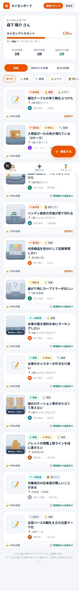
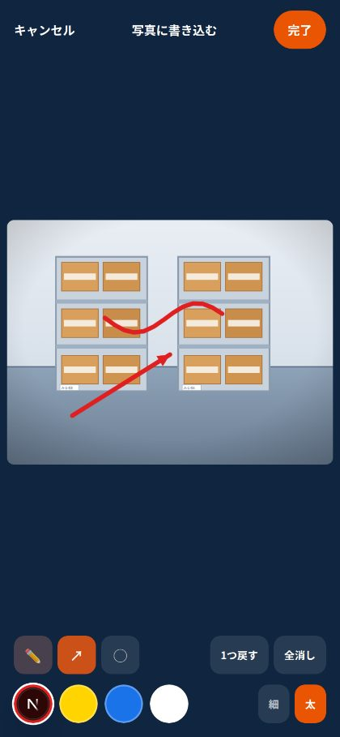
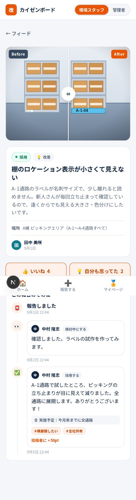
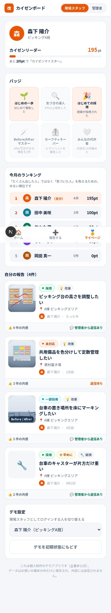
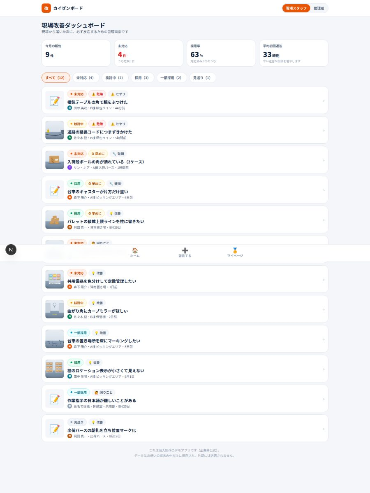

# カイゼンボード（KAIZEN BOARD）

**現場の気づきを、30秒で。返事は、必ず。**

倉庫・ピッキング現場のスタッフが、改善アイデア／破損・不具合／ヒヤリハット／困りごとを
**スマホから写真＋手書きで**共有できる、現場改善報告アプリです。
投稿には内容にかかわらずポイントが付き、管理者は「採用」「一部修正して採用」「お礼」などの
アクションで**必ず反応**します。

> ⚠️ これは個人制作のポートフォリオ用デモアプリです。特定の企業とは関係のない非公式の作品で、
> ロゴ等は使用していません。データはブラウザの中だけに保存され、外部には送信されません。

| 現場フィード | 写真に手書き | 報告の詳細 |
|---|---|---|
|  |  |  |

| マイページ（ポイント・バッジ） | 管理者ダッシュボード |
|---|---|
|  |  |

---

## 解こうとしている課題

現場で一番たくさん気づいているのは、そこで働いているスタッフ本人です。
それでも改善が進まないのは、たいてい次の3つが理由でした。

1. **報告の手間が大きい** … 紙の提案書、会議での発表、うまい文章。書く前に諦めてしまう。
2. **出しても反応がない** … 出した提案がどうなったか分からず、次から出さなくなる。
3. **採用されないと徒労に終わる** … 「良い案」だけが評価される仕組みだと、小さな気づきが埋もれる。

このアプリは、それぞれに対してこう答えます。

1. **写真＋手書き＋ひとことで30秒。** 文章が苦手でも、丸と矢印で伝わります。
2. **タイムラインで「その後」が見える。** 管理者のアクションが投稿に紐づいて時系列で残ります。
3. **採否にかかわらずポイントが入る。** 出すこと自体を称える設計にしています。

## 主な機能

### 現場スタッフ側（スマホ）
- **3ステップの投稿フロー** … ①種類と急ぎ具合 → ②写真と手書き → ③ひとこと
- **写真への手書き注釈** … ペン／矢印／丸、色4種・太さ2種、1つ戻す・全消し（HTML Canvas を自作）
- **Before / After 比較** … ドラッグで見比べられるスライダー（指・マウス・キーボード対応）
- **ポイントとレベル** … 獲得内訳のアニメーション、レベル、バッジ、今月のランキング
- **匿名投稿** … 名前を出さずに送れる（ポイントはきちんと付く）

### 管理者側（PC / タブレット）
- **KPI** … 今月の報告数／未対応件数（0件でなければ赤）／採用率／平均初回返答時間
- **トリアージ一覧** … ステータスで絞り込み、危険度の高い報告を上に固定
- **5種類のアクション** … ✅採用(+50pt) / 🛠一部修正して採用(+30pt) / 👀検討中 / 🙏お礼(+5pt) / 📁見送り（**理由必須**）
- 採用時は「実施予定」と「#横展開したい」などのタグを添えられる

### ポイント設計

| 行動 | pt |
|---|---|
| 報告する（内容問わず） | +10 |
| 写真を付ける | +5 |
| After写真も付ける | +10 |
| 採用された | +50 |
| 一部修正して採用された | +30 |
| 管理者からお礼 | +5 |
| 週3件の連続報告ボーナス | +20 |

## さわってみる

```bash
npm install
npm run dev
# http://localhost:3000
```

デモとして次の流れをひととおり体験できます（カメラのないPCでも、投稿画面の
「サンプル写真」から手書き機能を試せます）。

1. フィード右下の「＋ 報告する」から投稿 → ポイント獲得の演出
2. 画面右上の切り替えで**管理者**になり、ダッシュボードから同じ報告に「採用」アクション
3. **現場スタッフ**に戻って、マイページのポイント・レベル・バッジが増えているのを確認
4. リロードしてもデータは残ります（マイページの「デモを初期状態にもどす」で初期化）

## 技術構成

- **Next.js 16（App Router）/ React 19 / TypeScript / Tailwind CSS v4**
- バックエンドなし。**シードデータ＋ブラウザ内保存**で全機能が動きます
  - 報告などのメタデータ … `localStorage`
  - 投稿写真 … `IndexedDB`（Blob のまま保存。長辺1280pxへ縮小＋JPEG圧縮してから格納）
- 状態管理は `useSyncExternalStore` による自作ストア（依存パッケージを増やさない方針）
- 手書き注釈・画像合成は Canvas API を直接利用（座標は画像サイズに対する比率で保持）

```
src/
  app/            ルーティング（/ , /new , /report/[id] , /me , /admin , /admin/[id]）
  features/       各画面の実体
  components/     PhotoAnnotator, BeforeAfterSlider, Timeline, ReportCard など
  lib/            types / store / storage / points / stats / labels
  data/seed.ts    シードデータ
public/seed/      サンプル写真（SVGイラスト）
```

### バックエンドへの差し替え

データアクセスは `src/lib/store.ts` と `src/lib/storage.ts` に閉じています。
`listReports` 相当の読み出しと `createReport` / `addAdminAction` / `toggleReaction` の
中身を置き換えるだけで、Supabase などの実データベースに移行できます（画像は Storage、
テーブルは `reports` / `admin_actions` / `reactions` / `users` を想定）。

## 設計上の判断メモ

- **ポイントは投稿履歴から毎回計算する**（保存しない）。合計値を持たないので、
  管理者アクションの取り消しや再計算でズレが起きません。バッジも同じく導出値です。
- **未対応件数を管理画面の一番目立つ場所に赤で置く**。放置を仕組みで防ぐための表示です。
- **「見送り」だけコメント必須**。断るときこそ、次の投稿につながる言葉が要るためです。
- **画像座標は比率で保持**。端末や表示サイズが変わっても、書き込みの位置がずれません。
